# UTube

UTube is a website created to help people teach or entertain user. User can upload videos on UTube, see all videos made by them in your video section,see liked videos in liked video section, play any video on separate page. All users can see all videos and
share thoughts on videos in the comment section and edit, delete own comments. UTube is inspired by YouTube website.

## Live Link-
[Click here to view UTube Live Site](https://utube-clone-vg.herokuapp.com/)

Please see below link to project wiki:  
 [Feature List](https://github.com/varshagade211/UTube/wiki/Feature-List-of-UTube)   
 [Database Schema](https://github.com/varshagade211/UTube/wiki/Database-Schema)   
 [User Stories](https://github.com/varshagade211/UTube/wiki/User-Stories)  
<!-- [API Routes](https://github.com/varshagade211/AirBnB/wiki/API-Routes)    -->

### This project is built with:  

#### Frameworks, Platforms, and Libraries:
  
   
  
  
  

#### Database:
   
### ORM:

#### Hosting:
  

## Feature Directions:

User will be able to test features without signup. User can loging as Demo use by clicking on "Demo User" button in the sign in form

* Sign-Up form

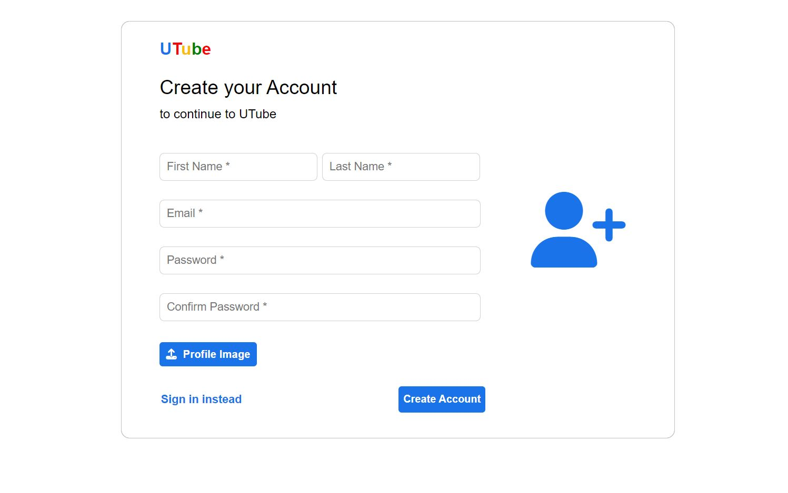 &nbsp;  &nbsp;  &nbsp;

* Sign-In form
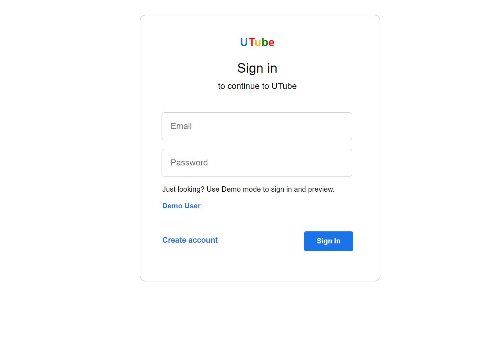 &nbsp;  &nbsp;  &nbsp;

* Home Page:

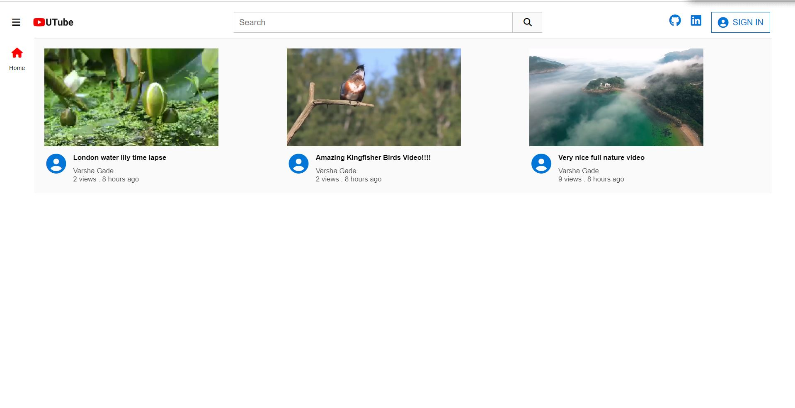 &nbsp;  &nbsp;  &nbsp;

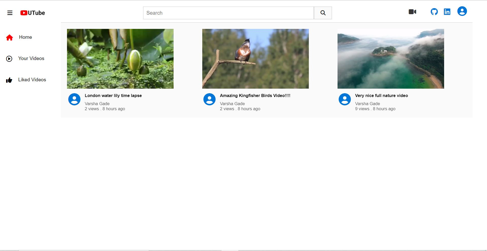 &nbsp;  &nbsp;  &nbsp;

* Single page playing video -

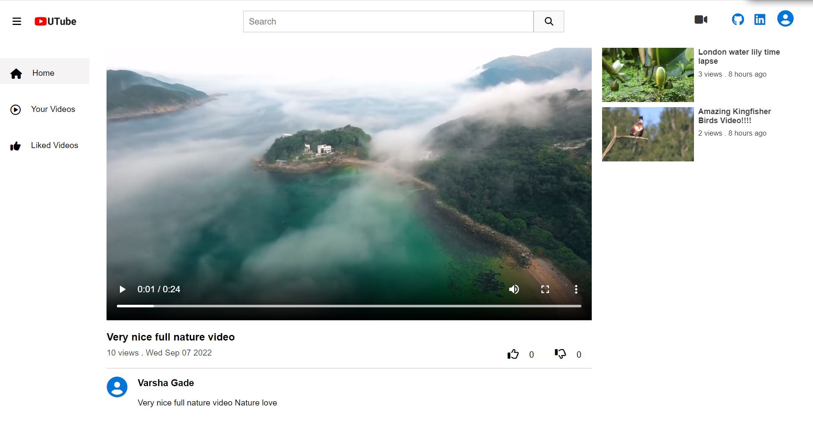 &nbsp;  &nbsp;  &nbsp;

* Comment section -

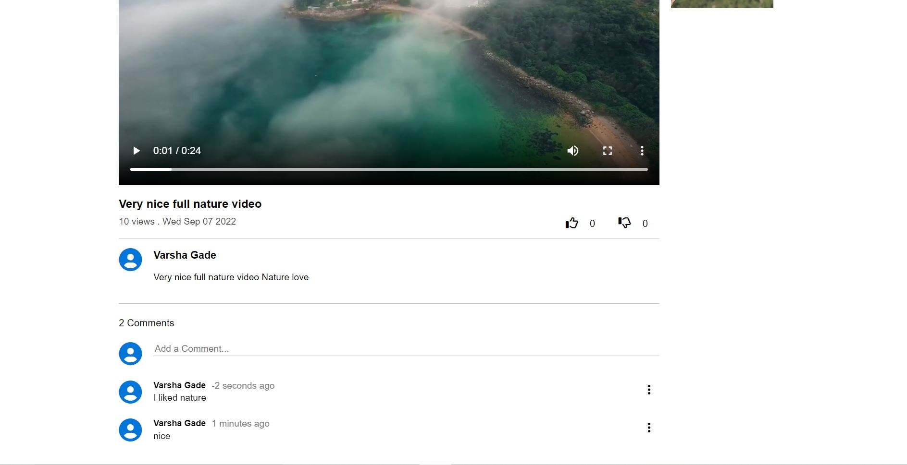 &nbsp;  &nbsp;  &nbsp;

* User's uploaded videos section -

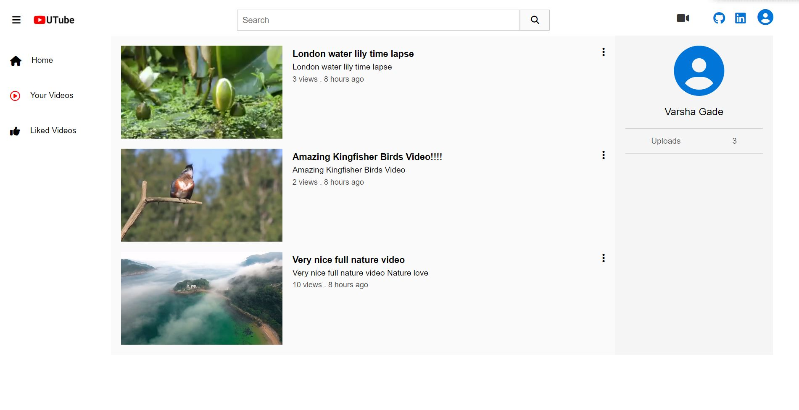 &nbsp;  &nbsp;  &nbsp;

* User's liked videos section -

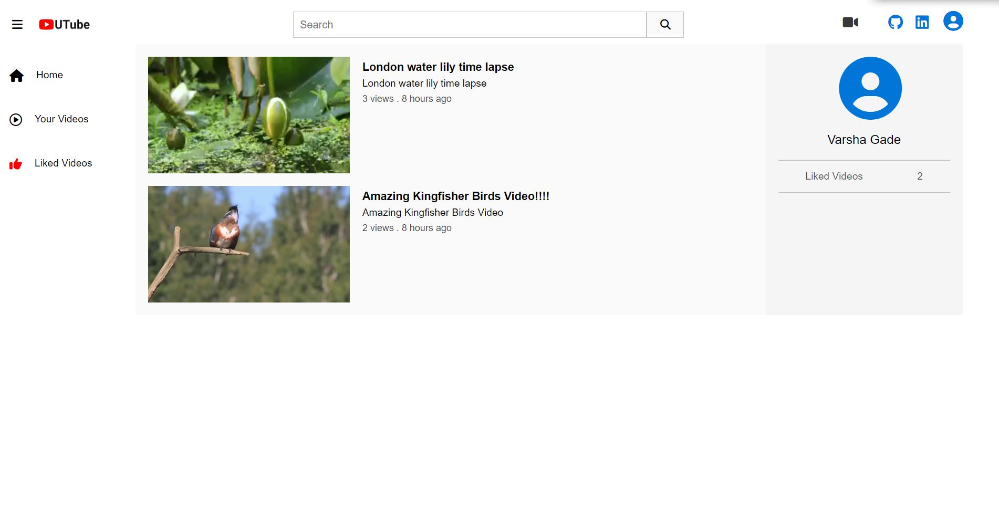 &nbsp;  &nbsp;  &nbsp;

* Upload video form

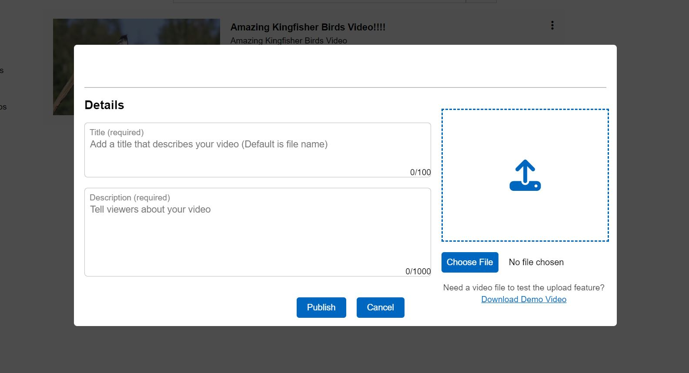 &nbsp;  &nbsp;  &nbsp;

* Edit video form

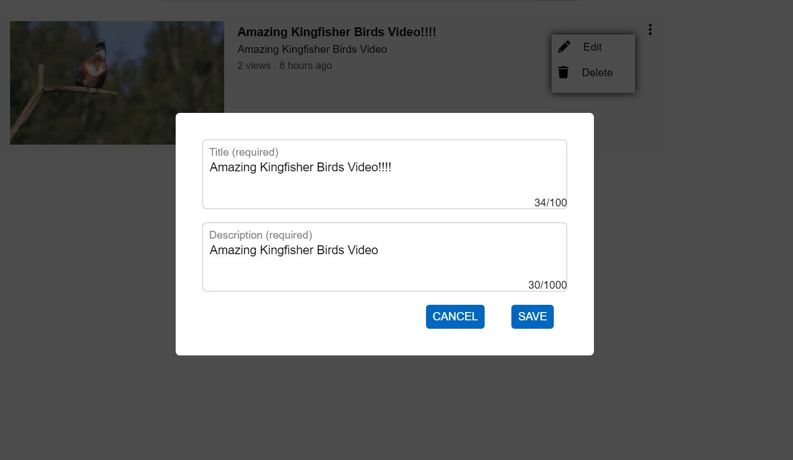 &nbsp;  &nbsp;  &nbsp;

* delete video form

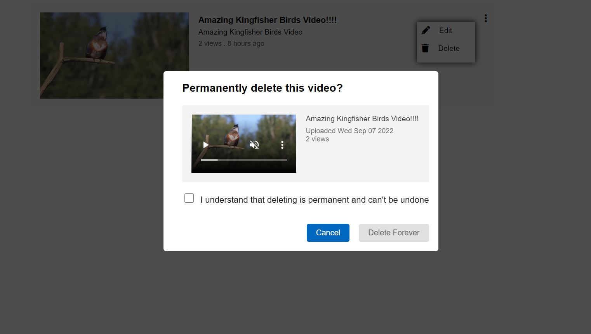 &nbsp;  &nbsp;  &nbsp;

* Edit comment form on open ups on the place after pressing edit button.

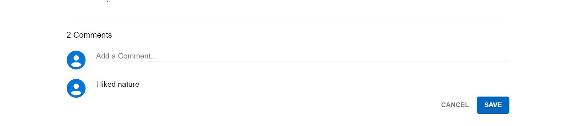 &nbsp;  &nbsp;  &nbsp;

* delete comment form

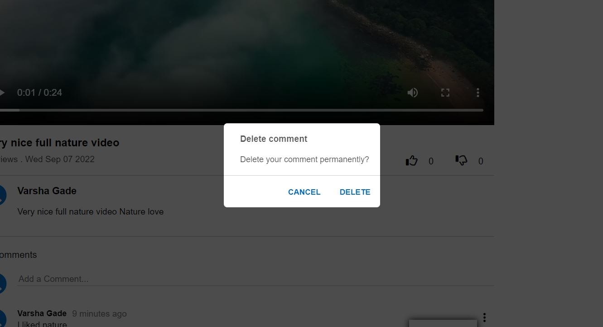 &nbsp;  &nbsp;  &nbsp;
